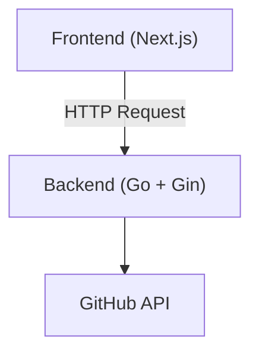

# GitHub Commit Analyzer

## Goal

To understand the continuity of development and activity trends.

## Feature

* Retrieve commit history
* Commit Classification
* Graph display
* Scoring function

## Architecture

## MVP Specification

### Scope

* Target: GitHub user (public repositories only)
* Period: Last 30 days
* Authentication: Not required (public data only)

---

### Backend (Go)

#### Technology Stack
- Go 1.21+
- Web framework: Gin
- HTTP Client: `net/http` or `github.com/go-resty/resty/v2`
- JSON handling: `encoding/json`
- Concurrency: goroutines + channels (optional, for faster API calls)

#### Endpoint

GET /users/{username}/stats

#### Processing

1. Retrieve commit history from GitHub API
2. Aggregate commits by date (daily count)
3. Classify commit messages:

   * "feat" → feature
   * "fix" → bugfix
   * others → other
4. Calculate score:
   score = (longest streak × 2) + total commits

### Frontend (Next.js)

#### UI

* Input field for GitHub username
* Button to fetch data

#### Display

* Bar chart of daily commits (last 30 days)
* Simple display of:

  * total commits
  * score

---

### Out of Scope

* Authentication (OAuth)
* Database (PostgreSQL)
* Private repositories
* Advanced analytics
* Selecting specific repositories instead of analyzing all public repositories
* UI optimization

---

### Definition of Done

* User can input a GitHub username
* Commit data is fetched and displayed
* Daily commit graph is visible
* Score is calculated and shown
